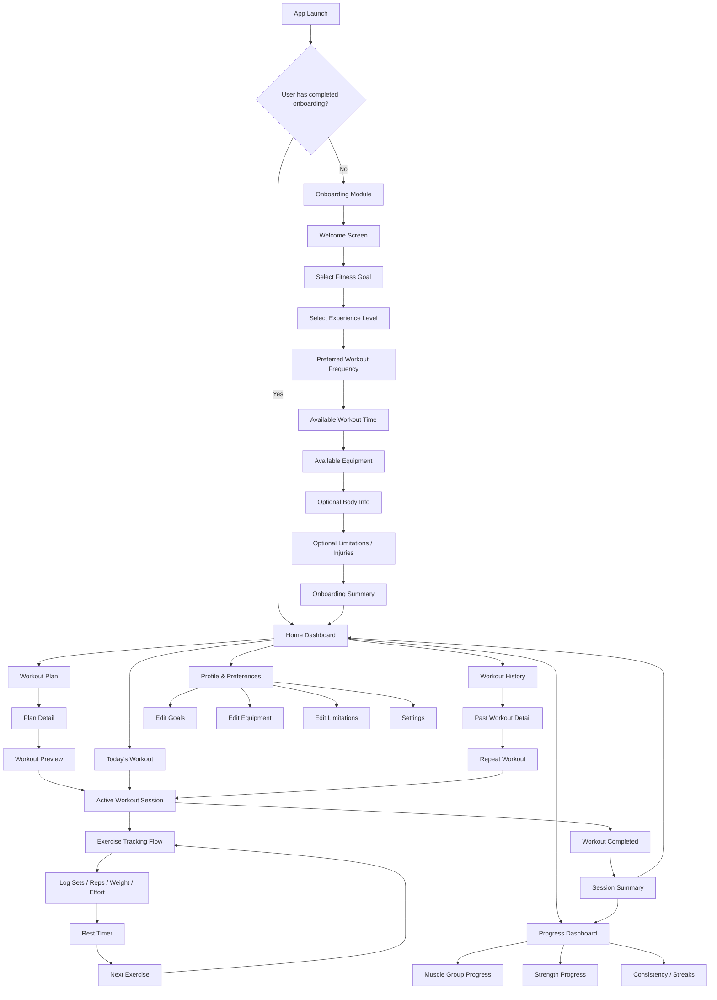

# Core Application Flow

This document is the canonical high-level product flow for the Gym Tracker app. Use it to understand how onboarding, dashboard navigation, plans, workouts, history, progress, and profile management connect.

## Flow Diagram

## Onboarding Step Order

The welcome screen introduces setup and is followed by 8 numbered onboarding steps:

| Step | Screen | Route |
|---:|---|---|
| — | Welcome Screen | `/onboarding/welcome` |
| 1 | Select Fitness Goal | `/onboarding/goal` |
| 2 | Select Experience Level | `/onboarding/experience` |
| 3 | Preferred Workout Frequency | `/onboarding/frequency` |
| 4 | Available Workout Time | `/onboarding/time` |
| 5 | Available Equipment | `/onboarding/equipment` |
| 6 | Optional Body Info | `/onboarding/body` |
| 7 | Optional Limitations / Injuries | `/onboarding/limitations` |
| 8 | Onboarding Summary | `/onboarding/summary` |

After the summary is completed, the user lands on the Home Dashboard.

## Current Implementation Status

| Area | Status |
|---|---|
| Welcome | Implemented |
| Fitness Goal | Implemented |
| Experience Level | Implemented |
| Workout Frequency | Placeholder route exists |
| Available Workout Time | Missing |
| Available Equipment | Missing |
| Optional Body Info | Missing |
| Optional Limitations / Injuries | Missing |
| Onboarding Summary / completion | Missing |

## Routing Rule

At app launch:

- If the user has not completed onboarding, route them into the onboarding module.
- If the user has completed onboarding, route them to the Home Dashboard.

The onboarding completion signal should be saved after the summary step so returning users do not repeat onboarding.
